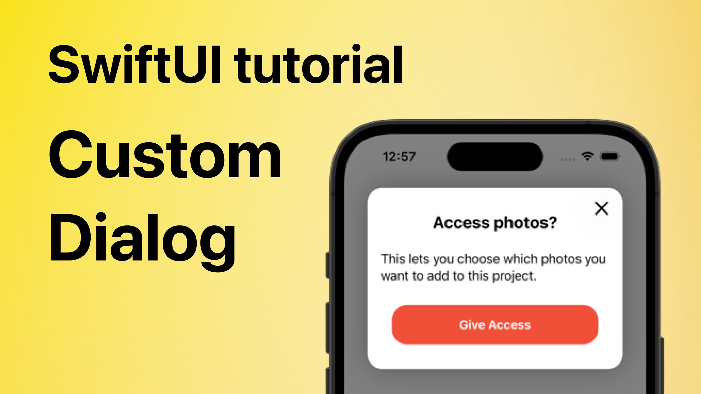

# Create a Custom Dialog in SwiftUI

This is a code from the YT video "Create a Custom Dialog in SwiftUI" 🤗

You will learn how to create a custom dialog in SwiftUI. Enjoy 🤓

## Links:
- [Link to the video](https://www.youtube.com/watch?v=K5lj-S3grno)
- [Pre-alert screens](https://developer.apple.com/design/human-interface-guidelines/patterns/accessing-private-data/#pre-alert-screens)